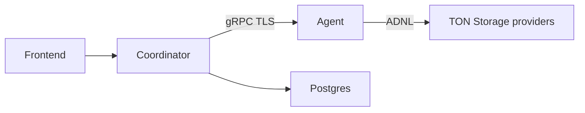

# mytonprovider-backend

**[Русская версия](README.ru.md)**

Backend for [mytonprovider.org](https://mytonprovider.org) — monitoring and health checks for TON Storage providers.

## Architecture

Two Go services share protobuf contracts in `contracts/`:

| Component | Role |
|-----------|------|
| **coordinator** | HTTP API for the frontend, Postgres, background workers (provider lifecycle, telemetry, cleanup), orchestrates checks via gRPC to agents |
| **agent** | gRPC service (`RunChecks`, `RunStorageRates`), ADNL transport to providers, optional Prometheus metrics and Loki push |



## Repository layout

```
├── agent/              # gRPC check agent
├── coordinator/        # API, workers, db/init.sql
├── contracts/          # proto + generated Go
├── observability/      # local Prometheus + Grafana + Loki (dev)
├── Taskfile.yml        # proto, tests, deploy tasks
└── go.work
```

## Development

**Prerequisites:** Go 1.26+ ([go.work](go.work)), [Task](https://taskfile.dev), `grpcurl`, `openssl`, `protoc` (for `task proto:gen`).

```bash
# Regenerate protobuf (after editing contracts/proto)
task proto:gen
task proto:check

# Run agent locally with test TLS + token
task agent:run:test
```

In another terminal — gRPC smoke tests (agent must already be running):

```bash
task agent:test:smoke
```

Live checks against real TON data: [agent/tests/grpc/README.md](agent/tests/grpc/README.md) · [RU](agent/tests/grpc/README.ru.md).

**TLS for production agents:** [agent/README.md](agent/README.md) · [RU](agent/README.ru.md)

### VS Code

Example `launch.json` entries:

```json
{
  "version": "0.2.0",
  "configurations": [
    {
      "name": "Coordinator",
      "type": "go",
      "request": "launch",
      "mode": "auto",
      "program": "${workspaceFolder}/coordinator/cmd",
      "buildFlags": "-tags=debug"
    },
    {
      "name": "Agent",
      "type": "go",
      "request": "launch",
      "mode": "auto",
      "program": "${workspaceFolder}/agent/cmd/agent"
    }
  ]
}
```

Set `env` in each configuration to match `coordinator/deploy/.env.example` or test vars from `Taskfile.yml` (`task agent:run:test`).

## Docker deploy (VPS)

| Stack | Docs | Notes |
|-------|------|--------|
| Agent (+ optional monitoring) | [EN](agent/deploy/README.md) · [RU](agent/deploy/README.ru.md) | **VPS: prefer Docker Hub** — build image locally, pull on server |
| Coordinator (+ Postgres + monitoring) | [EN](coordinator/deploy/README.md) · [RU](coordinator/deploy/README.ru.md) | Builds coordinator image **on VPS** (`deploy:up`) |

**Agent on VPS (recommended):** build and push on your machine, then hub deploy — see [agent/deploy/README.md](agent/deploy/README.md#production--vps-docker-hub--recommended).

```bash
# Dev machine
AGENT_IMAGE=<user>/mytonprovider-agent:latest task agent:image:build:push
# VPS
task agent:hub:init && nano agent/deploy/.env.hub && task agent:hub:stack:up
```

**Coordinator quick start** (build on VPS):

```bash
task coordinator:deploy:init
nano coordinator/deploy/.env
task coordinator:deploy:up
```

**Agent build on VPS** (dev / debugging only):

```bash
task agent:deploy:init
nano agent/deploy/.env
task agent:deploy:up
```

## Local observability

Prometheus + Grafana + Loki for development: [EN](observability/prometheus-grafana/README.md) · [RU](observability/prometheus-grafana/README.ru.md).

## Coordinator API and workers

REST API (Fiber): telemetry, provider listing/filters, metrics.

Background workers:

- **Providers Master** — provider lifecycle, health checks, gRPC to agents
- **Telemetry Worker** — incoming provider telemetry
- **Cleaner Worker** — database retention

## License

Apache-2.0 — see [LICENSE](LICENSE).

This project was created by order of a TON Foundation community member.
