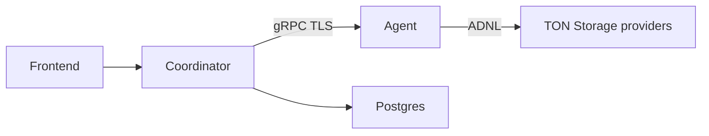

# mytonprovider-backend

Backend для [mytonprovider.org](https://mytonprovider.org) — мониторинг и проверки здоровья провайдеров TON Storage.

## Архитектура

Два Go-сервиса и общие protobuf-контракты в `contracts/`:

| Компонент | Назначение |
|-----------|------------|
| **coordinator** | HTTP API для фронтенда, Postgres, фоновые воркеры (жизненный цикл провайдеров, телеметрия, очистка), вызов проверок по gRPC к агентам |
| **agent** | gRPC (`RunChecks`, `RunStorageRates`), ADNL к провайдерам, опционально Prometheus и push в Loki |



## Структура репозитория

```
├── agent/              # gRPC-агент проверок
├── coordinator/        # API, воркеры, db/init.sql
├── contracts/          # proto и сгенерированный Go
├── observability/      # локальный Prometheus + Grafana + Loki (dev)
├── Taskfile.yml        # proto, тесты, деплой
└── go.work
```

## Разработка

**Нужно:** Go 1.26+ ([go.work](go.work)), [Task](https://taskfile.dev), `grpcurl`, `openssl`, `protoc` (для `task proto:gen`).

```bash
# Перегенерация protobuf (после правок contracts/proto)
task proto:gen
task proto:check

# Локальный агент с тестовым TLS и токеном
task agent:run:test
```

В другом терминале — gRPC smoke (агент уже должен быть запущен):

```bash
task agent:test:smoke
```

Живые проверки с реальными данными TON: [agent/tests/grpc/README.md](agent/tests/grpc/README.md).

**TLS для продакшн-агентов:** [agent/README.md](agent/README.md)

### VS Code

Пример `launch.json`:

```json
{
  "version": "0.2.0",
  "configurations": [
    {
      "name": "Coordinator",
      "type": "go",
      "request": "launch",
      "mode": "auto",
      "program": "${workspaceFolder}/coordinator/cmd",
      "buildFlags": "-tags=debug"
    },
    {
      "name": "Agent",
      "type": "go",
      "request": "launch",
      "mode": "auto",
      "program": "${workspaceFolder}/agent/cmd/agent"
    }
  ]
}
```

Переменные `env` задайте по `coordinator/deploy/.env.example` или по тестовым значениям из `Taskfile.yml` (`task agent:run:test`).

## Docker-деплой (VPS)

Сценарий: клон → `task` init → правка `.env` → `up`.

| Стек | Документация |
|------|----------------|
| Agent (+ опционально мониторинг) | [agent/deploy/README.md](agent/deploy/README.md) |
| Coordinator (+ Postgres + мониторинг) | [coordinator/deploy/README.md](coordinator/deploy/README.md) |

Быстрый старт:

```bash
task agent:deploy:init
nano agent/deploy/.env
task agent:deploy:up
```

```bash
task coordinator:deploy:init
nano coordinator/deploy/.env
task coordinator:deploy:up
```

## Локальная observability

Отдельный стек Prometheus + Grafana + Loki для разработки: [observability/prometheus-grafana/README.md](observability/prometheus-grafana/README.md).

## API и воркеры coordinator

REST (Fiber): телеметрия, список/фильтры провайдеров, метрики.

Фоновые воркеры:

- **Providers Master** — жизненный цикл провайдеров, health checks, gRPC к агентам
- **Telemetry Worker** — телеметрия от провайдеров
- **Cleaner Worker** — очистка устаревших данных в БД

## Лицензия

Apache-2.0 — см. [LICENSE](LICENSE).

Проект создан по заказу участника сообщества TON Foundation.
